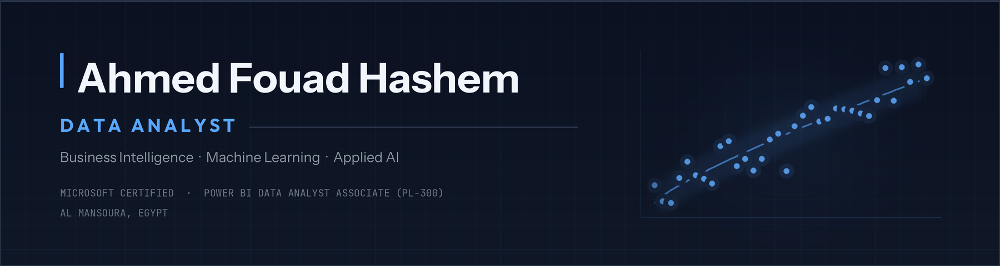

  

  
  
  
  

---

## About

I build the whole chain — from raw, messy sources through statistical modelling and evaluation, to the dashboards and applications people actually make decisions with.

My background is in Management Information Systems, followed by 9+ months of intensive applied training at **Digilians (Egyptian Military Academy)**, where I designed and deployed 10+ end-to-end ML pipelines on datasets exceeding 100K records. I'm **Microsoft Certified: Power BI Data Analyst Associate (PL-300)**, with additional certification from IBM, Stanford &amp; DeepLearning.AI, and Google.

What I care about most is the part that usually gets skipped: **evaluation**. A model reporting 99% accuracy without a leakage-free test set, a documented failure analysis, and a way for a human to audit its output isn't a result — it's a claim. Every project below ships with the evidence.

---

## What I Do

**Analytics &amp; Business Intelligence**
Data cleaning and exploratory analysis at scale · statistical analysis and hypothesis testing · RFM and cohort segmentation · Power BI and Tableau reporting built for non-technical stakeholders.

**Machine Learning**
Supervised and unsupervised modelling · deep learning (ANN, CNN, LSTM, transformers) · feature engineering · hyperparameter tuning · rigorous, honest model evaluation.

**Applied AI Systems**
Retrieval-augmented generation · hybrid search and reranking · computer vision pipelines · delivered behind FastAPI, Streamlit, and React interfaces.

---

## Featured Work

### [SupportFlow AI — Hybrid RAG for Customer Support](https://github.com/HashemIlI/SupportFlow-AI)

*A retrieval system that knows when **not** to answer.*

`Python` `Streamlit` `ChromaDB` `BGE Embeddings` `BM25` `Cross-Encoder Reranking` `Groq API`

- Combined dense retrieval (BGE embeddings) with BM25 lexical search, fused via **Reciprocal Rank Fusion** and refined by cross-encoder reranking.
- **100% Hit Rate@5** and **95.9% Mean Reciprocal Rank** on an 810-question, leakage-free held-out test set.
- Calibrated an **abstention gate** that declines unsupported questions — **90.2% answerability accuracy (94.3% F1)**. This is the difference between an assistant that helps and one that fabricates.
- Shipped with conversation memory, semantic answer caching, cited sources, and a **73-test automated suite**.

### [Smart-City CCTV Violence Detection (SCVD)](https://github.com/HashemIlI/SCVD)

*Real-time video classification with an evidence trail a human can audit.*

`Python` `PyTorch` `OpenCV` `ResNet18 + LSTM` `YOLO11n` `Gradio` `Streamlit`

- Built a **CNN + LSTM** classifier (frozen ResNet18 backbone, 2-layer LSTM) labelling footage as *Normal*, *Violence*, or *Weaponized* — **99.8% test accuracy**.
- Designed a **sliding-window inference pipeline** (2s window, 1s stride) with temporal smoothing and event merging to localise incidents on a timeline.
- Added a parallel **YOLO11n** person-detection branch and an automated Arabic explainability report with downloadable HTML evidence export.
- Deployed dual Gradio and Streamlit dashboards over a single shared inference core, with interactive probability charts and an incident timeline.

### [E-Commerce Management System](https://github.com/HashemIlI/E-Commerce_Management_System)

*The full analyst loop — clean it, model it, then say what to do about it.*

`Python` `SQL` `Pandas` `Scikit-learn` `Matplotlib/Seaborn` `Power BI`

- Built an end-to-end EDA and machine learning pipeline on a real-world retail dataset: cleaning, feature engineering, and predictive modelling.
- Applied **RFM segmentation** to isolate three distinct customer personas, and found the **top 10 products drive over 60% of total revenue**.
- Built regression and classification models for sales forecasting and segmentation, surfacing a **Q4 seasonal revenue surge** and a measurable link between repeat-purchase rate and discount depth.
- Delivered an interactive **Power BI dashboard** translating the analysis into revenue, retention, and product-strategy recommendations.

---

## Selected Additional Work

| Project | Stack | Summary |
| :--- | :--- | :--- |
| **InterviewIQ** *(graduation project)* | PyTorch · Wav2Vec2-XLSR · Swin-T + LoRA · FastAPI · React | Multimodal mock-interview evaluation across NLP, audio, and vision branches, combined by a fusion engine into a delivery-confidence score. |
| **AI Data Analyst Assistant** | FastAPI · React · Ollama (LLaMA 3) · ReportLab | Offline-first analytics platform driven by a 16-step asynchronous EDA pipeline, with LLM-generated executive summaries and automated PDF reporting — running entirely on local hardware. |
| **[Personal Portfolio](https://myportfolio-one-roan-25.vercel.app/)** | Next.js · Vercel Blob · ISR | Portfolio site with a full headless CMS dashboard, dynamic skill and category systems, RTL and dark-mode support. |
| **Arabic Audio Intelligence** *(team project)* | PyTorch · Wav2Vec2-XLSR · BiLSTM | Evidence-only stereo call review classifying vocal activation from Arabic call recordings. 89.2% macro F1 on validation; re-evaluated on a speaker-disjoint test set to measure true generalisation. |
| **AI Support Brain** | n8n · Ollama · Qdrant · Google Sheets | Automation workflow wiring a self-hosted LLM and vector store into a support-ticket pipeline. |

---

## Experience

**Applied AI &amp; Data Analytics** — Digilians, Egyptian Military Academy · 9 Months

- Designed and deployed **10+ end-to-end ML pipelines** on datasets up to **100K+ records**, covering preprocessing, feature engineering, model selection, and evaluation.
- Built and tuned **10+ predictive models** (Random Forest, Logistic Regression, ANN) to **98% classification accuracy**, improving performance **15–20%** through hyperparameter search, cross-validation, and regularisation.
- Moved beyond tabular modelling into **deep learning and multimodal systems** — CNN + LSTM video classification, Wav2Vec2-XLSR audio models, and retrieval-augmented generation over vector stores.
- Built and evaluated **hybrid retrieval pipelines** (dense embeddings + BM25, cross-encoder reranking, abstention calibration), measured with Hit Rate@k and MRR on held-out question sets rather than by inspection.
- Automated cleaning and transformation workflows in Python, cutting data preprocessing time by **30%**.
- Ran statistical analysis and hypothesis testing on real-world datasets, and delivered **10+ analytical reports and interactive Power BI dashboards** translating results into business recommendations.

---

## Technical Skills

<table>
  <tr>
    <td valign="middle"><b>Languages &amp; Data</b></td>
    <td>
      
      
      
       DAX · Power Query (M) · data modelling · row-level security
    </td>
  </tr>
  <tr>
    <td valign="middle"><b>Analysis &amp; BI</b></td>
    <td>
      
      
      
      
       Matplotlib · Seaborn · Plotly · EDA · hypothesis testing
    </td>
  </tr>
  <tr>
    <td valign="middle"><b>Machine Learning</b></td>
    <td>
      
      
      
      
       Regression · classification · clustering · ANN · CNN · LSTM · transformers
    </td>
  </tr>
  <tr>
    <td valign="middle"><b>Applied AI</b></td>
    <td>
      
      
       RAG · hybrid retrieval · cross-encoder reranking · ChromaDB · Qdrant · Groq · Ollama · YOLO11
    </td>
  </tr>
  <tr>
    <td valign="middle"><b>Delivery</b></td>
    <td>
      
      
      
      
       Gradio · Docker · REST APIs · automated testing
    </td>
  </tr>
</table>

---

## Certifications

| Certification | Issuer | Date | |
| :--- | :--- | :--- | :--- |
| Power BI Data Analyst Associate (PL-300) | Microsoft | Jul 2026 | [Verify](https://learn.microsoft.com/api/credentials/share/en-us/HashemIlI/3E445F6A79E9EFEA?sharingId=2C8075EFDD862BF1) |
| AI Engineering Professional Certificate | IBM | May 2026 | [Verify](https://coursera.org/share/751910bb1ea2008c8ab270bfae418942) |
| Machine Learning Specialization | Stanford University &amp; DeepLearning.AI | Feb 2025 | [Verify](https://coursera.org/share/8ecbc924a8fd029e51a672022fece206) |
| Advanced Data Analytics Professional Certificate | Google | Jul 2024 | [Verify](https://coursera.org/share/f54c663762fa49c3ac1b8e5910c33617) |
| Professional Soft Skills Learning Pathway | LinkedIn | Mar 2024 | — |
| Data Analytics Professional Certificate | Google | Dec 2023 | [Verify](https://coursera.org/share/ff55fa7b4e8e027a082c74b2d3bc6f34) |

---

## Education &amp; Languages

**Bachelor of Management Information Systems** — Delta University, Egypt · 2019–2023

**Arabic** — Native &nbsp;&nbsp;|&nbsp;&nbsp; **English** — Professional Proficiency

---

## Contact

Open to **Data Analyst**, **Data Scientist**, and **Applied AI / Machine Learning** roles, as well as freelance work in analytics, dashboarding, and LLM-powered applications.

  
  

